# Data processing

## m6a regulators

* 30 m6a regulators (DOI: 10.1186/s12943-021-01408-5)


## TCGA-PAAD dataset option 1

* 所有regulators
* SMAD4表达cutoff 50%

```{r,echo=FALSE,eval=FALSE,cache=TRUE}  
# dir.create('./Result/02-data_processing')
rm(list = ls())
library(tidyverse)
library(magrittr)
library(GSVA)

load('../A01_Data_Processing/PAAD/TCGA/tcga_tmb_snp_cnv.rds')
load('/Users/djchen/Desktop/R data/A01_Data_Processing/PAAD/all_15_set.rds')
m6a_gene <- read.table('./Data/30_m6a_regulators.txt')
m6a_gene <- c(m6a_gene$V1,'SMAD4')
tcga_exp <- all_15_set$TCGA %>% column_to_rownames('ID')
exp <- tcga_exp[,colnames(tcga_exp) %in% m6a_gene]
exp <- exp[rownames(exp) %in% colnames(TCGA_SNP),]
exp <- exp[colnames(TCGA_CNV),]
TCGA_SNP <- as.data.frame(t(TCGA_SNP))
identical(rownames(TCGA_SNP),rownames(exp))

dat <- exp
dat$mut_group <- ifelse(TCGA_SNP$SMAD4 == '','SMAD4_Wildtype','SMAD4_Mutated')
dat$exp_group <- ifelse(dat$SMAD4 > median(dat$SMAD4,na.rm = T),'SMAD4_High','SMAD4_Low')

# calculte the m6A score use GSVA
gmt_m6a <- list(m6a=m6a_gene)
exp_2 <- tcga_exp[,-c(1,2)] %>% t() %>% as.data.frame()
exp_2 <- exp_2[,rownames(dat)]
m6a_score <- gsva(as.matrix(exp_2), gmt_m6a,method='gsva',parallel.sz=5)
identical(colnames(m6a_score),rownames(dat))
dat$m6a_score <- as.numeric(m6a_score)
nr <-  function(x){(x - min(x))/diff(range(x))}
dat$m6a_score <- nr(dat$m6a_score)
dat <- dat[,-grep('SMAD4',colnames(dat))]

```

#### TCGA_SMAD4_mutation_exp_m6a_boxplot

```{r,echo=FALSE,eval=FALSE,cache=TRUE}
library(ggplot2)
library(ggsignif)

col <- c("#B71375","#F79540","#FC4F00")

p1 <- ggplot(data=dat)+
  stat_boxplot(aes(x=mut_group,y=m6a_score,colour = mut_group),geom="errorbar",width=0.3,size=1)+
  geom_boxplot(mapping=aes(x=mut_group,y=m6a_score,colour = mut_group),
               size=1,
               width = 0.6,
               outlier.color = NA)+
  scale_color_manual(limits=c('SMAD4_Mutated','SMAD4_Wildtype'),
                     values=c("#B71375","#F79540"))+
  geom_signif(mapping=aes(x=mut_group,y=m6a_score),
              comparisons = list(c("SMAD4_Mutated","SMAD4_Wildtype")),
              map_signif_level=T,
              tip_length=0,
              y_position = max(dat$m6a_score),
              size=0.7,
              textsize = 4,
              test = "wilcox.test")+
  theme_classic()+
  labs(title='',x="",y='m6A score')+
  theme(
    legend.position = 'none',
    axis.text.x = element_text(size = 13,
                               color = "black",
                               vjust = 0.5,
                               hjust = 0.5,
                               angle = 0),
    axis.text.y = element_text(size = 13,
                               color = "black",
                               vjust = 0.5,
                               hjust = 0.5,
                               angle = 0) ,
    axis.title.y = element_text(size = 15,
                                color = "black",
                                vjust = 1.9,
                                hjust = 0.5,
                                angle = 90)
  )


p2 <- ggplot(data=dat)+
  stat_boxplot(aes(x=exp_group,y=m6a_score,colour = exp_group),geom="errorbar",width=0.3,size=1)+
  geom_boxplot(mapping=aes(x=exp_group,y=m6a_score,colour = exp_group),
               size=1,
               width = 0.6,
               outlier.color = NA)+
  scale_color_manual(limits=c('SMAD4_High','SMAD4_Low'),
                     values=c("#B71375","#F79540"))+
  geom_signif(mapping=aes(x=exp_group,y=m6a_score),
              comparisons = list(c("SMAD4_High","SMAD4_Low")),
              map_signif_level=T,
              tip_length=0,
              y_position = max(dat$m6a_score),
              size=0.7,
              textsize = 4,
              test = "wilcox.test")+
  theme_classic()+
  labs(title='',x="",y='m6A score')+
  theme(
    legend.position = 'none',
    axis.text.x = element_text(size = 13,
                               color = "black",
                               vjust = 0.5,
                               hjust = 0.5,
                               angle = 0),
    axis.text.y = element_text(size = 13,
                               color = "black",
                               vjust = 0.5,
                               hjust = 0.5,
                               angle = 0) ,
    axis.title.y = element_text(size = 15,
                                color = "black",
                                vjust = 1.9,
                                hjust = 0.5,
                                angle = 90)
  )

library(gridExtra)
p3 <- grid.arrange(p1,p2,ncol=2)
ggsave('./Result/02-data_processing/TCGA_SMAD4_mutation_exp_m6a_boxplot.png',p3,width=4.5*2,height=5.5,)

```

```{r,  echo=FALSE,out.width='80%',out.height='80%',fig.align='center',cache=TRUE}
library(knitr)
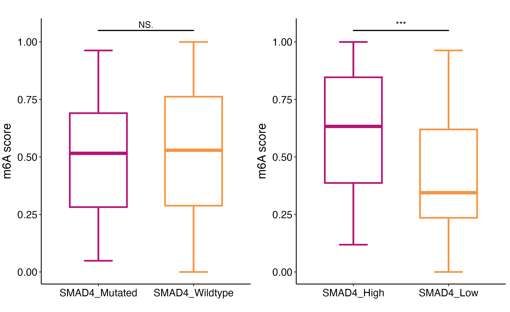

```

#### TCGA_SMAD4_mutation_exp_m6a_gene_boxplot

```{r,echo=FALSE,eval=FALSE,cache=TRUE}
library(ggplot2)
library(ggsignif)
library(ggpubr)

dat_mut <- dat[,-(32:33)] %>% reshape2::melt(id.vars = c('mut_group'))
m6a_gene <- read.table('./Data/30_m6a_regulators.txt')
m6a_gene <- c(m6a_gene$V1)
dat_mut$variable <- factor(dat_mut$variable,levels = m6a_gene)

p1 <- ggboxplot(dat_mut, x = "variable", y = "value",
          fill = "mut_group", 
          palette = c("#B71375","#F79540"),
          outlier.shape=NA,
          size=0.3)+
  theme_bw()+
  stat_compare_means(aes(group = mut_group),
                     method = "wilcox.test",
                     label = "p.signif",
                     symnum.args=list(cutpoints = c(0, 0.001, 0.01, 0.05, 1),
                                      symbols = c("***", "**", "*", "ns")))+
  theme(panel.grid.major=element_line(colour=NA),
        panel.background = element_rect(fill = "transparent",colour = NA),
        plot.background = element_rect(fill = "transparent",colour = NA),
        panel.grid.minor = element_blank(),
        text = element_text(size=13),
        axis.text.x = element_text(angle=45, hjust=1),
        legend.position="top")+
  labs(x="", y="Expression of m6A regualtors",title = "")

dat_exp <- dat[,-c(31,33)] %>% reshape2::melt(id.vars = c('exp_group'))
m6a_gene <- read.table('./Data/30_m6a_regulators.txt')
m6a_gene <- c(m6a_gene$V1)
dat_exp$variable <- factor(dat_exp$variable,levels = m6a_gene)

p2 <- ggboxplot(dat_exp, x = "variable", y = "value",
          fill = "exp_group", 
          palette = c("#B71375","#F79540"),
          outlier.shape=NA,
          size=0.3)+
  theme_bw()+
  stat_compare_means(aes(group = exp_group),
                     method = "wilcox.test",
                     label = "p.signif",
                     symnum.args=list(cutpoints = c(0, 0.001, 0.01, 0.05, 1),
                                      symbols = c("***", "**", "*", "ns")))+
  theme(panel.grid.major=element_line(colour=NA),
        panel.background = element_rect(fill = "transparent",colour = NA),
        plot.background = element_rect(fill = "transparent",colour = NA),
        panel.grid.minor = element_blank(),
        text = element_text(size=13),
        axis.text.x = element_text(angle=45, hjust=1),
        legend.position="top")+
  labs(x="", y="Expression of m6A regualtors",title = "")

library(gridExtra)
p3 <- grid.arrange(p1,p2,ncol=1,nrow=2)
ggsave('./Result/02-data_processing/TCGA_SMAD4_mutation_exp_m6a_gene_boxplot.png',p3,width=15,height=5*2)

```

```{r,  echo=FALSE,out.width='100%',out.height='100%',fig.align='center',cache=TRUE}
library(knitr)
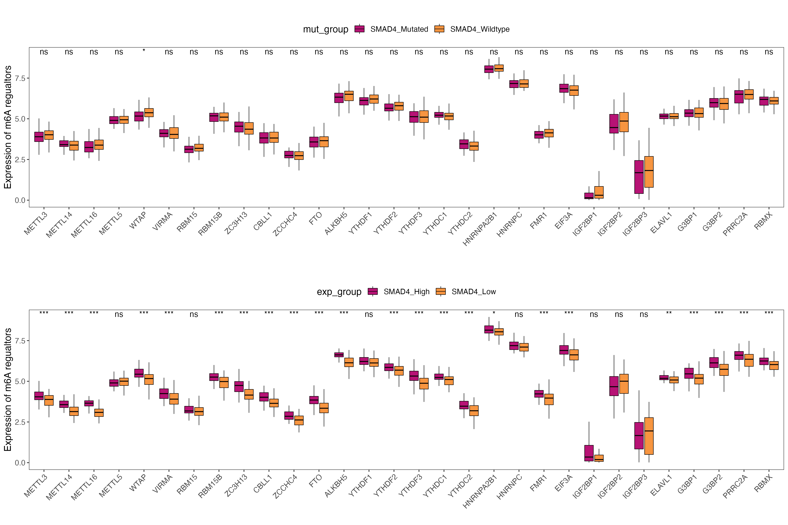

```


## TCGA-PAAD dataset option 2 

* 所有regulators
* SMAD4表达cutoff 25% (30%不用看了趋势肯定是一致的)


```{r,echo=FALSE,eval=FALSE,cache=TRUE}  
# dir.create('./Result/02-data_processing')
rm(list = ls())
library(tidyverse)
library(magrittr)
library(GSVA)

load('../A01_Data_Processing/PAAD/TCGA/tcga_tmb_snp_cnv.rds')
load('/Users/djchen/Desktop/R data/A01_Data_Processing/PAAD/all_15_set.rds')
m6a_gene <- read.table('./Data/30_m6a_regulators.txt')
m6a_gene <- c(m6a_gene$V1,'SMAD4')
tcga_exp <- all_15_set$TCGA %>% column_to_rownames('ID')
exp <- tcga_exp[,colnames(tcga_exp) %in% m6a_gene]
exp <- exp[rownames(exp) %in% colnames(TCGA_SNP),]
exp <- exp[colnames(TCGA_CNV),]
TCGA_SNP <- as.data.frame(t(TCGA_SNP))
identical(rownames(TCGA_SNP),rownames(exp))

dat <- exp
dat$mut_group <- ifelse(TCGA_SNP$SMAD4 == '','SMAD4_Wildtype','SMAD4_Mutated')

lower_quantile <- quantile(dat$SMAD4, 0.25)
upper_quantile <- quantile(dat$SMAD4, 0.75)

bottom_25 <- rownames(dat[dat$SMAD4 <= lower_quantile,])
top_25 <- rownames(dat[dat$SMAD4 >= upper_quantile,])

dat$exp_group <- ifelse(rownames(dat) %in% top_25,'SMAD4_top25',
                        ifelse(rownames(dat) %in% bottom_25,'SMAD4_bottom25',NA))

dat <- dat %>% drop_na(exp_group)

# calculte the m6A score use GSVA
gmt_m6a <- list(m6a=m6a_gene)
exp_2 <- tcga_exp[,-c(1,2)] %>% t() %>% as.data.frame()
exp_2 <- exp_2[,rownames(dat)]
m6a_score <- gsva(as.matrix(exp_2), gmt_m6a,method='gsva',parallel.sz=5)
identical(colnames(m6a_score),rownames(dat))
dat$m6a_score <- as.numeric(m6a_score)
nr <-  function(x){(x - min(x))/diff(range(x))}
dat$m6a_score <- nr(dat$m6a_score)
dat <- dat[,-grep('SMAD4',colnames(dat))]

```

#### TCGA_SMAD4_mutation_exp_m6a_boxplot_2

```{r,echo=FALSE,eval=FALSE,cache=TRUE}
library(ggplot2)
library(ggsignif)

col <- c("#B71375","#F79540","#FC4F00")


p <- ggplot(data=dat)+
  stat_boxplot(aes(x=exp_group,y=m6a_score,colour = exp_group),geom="errorbar",width=0.3,size=1)+
  geom_boxplot(mapping=aes(x=exp_group,y=m6a_score,colour = exp_group),
               size=1,
               width = 0.6,
               outlier.color = NA)+
  scale_color_manual(limits=c('SMAD4_top25','SMAD4_bottom25'),
                     values=c("#B71375","#F79540"))+
  geom_signif(mapping=aes(x=exp_group,y=m6a_score),
              comparisons = list(c("SMAD4_top25","SMAD4_bottom25")),
              map_signif_level=T,
              tip_length=0,
              y_position = max(dat$m6a_score),
              size=0.7,
              textsize = 4,
              test = "wilcox.test")+
  theme_classic()+
  labs(title='',x="",y='m6A score')+
  theme(
    legend.position = 'none',
    axis.text.x = element_text(size = 13,
                               color = "black",
                               vjust = 0.5,
                               hjust = 0.5,
                               angle = 0),
    axis.text.y = element_text(size = 13,
                               color = "black",
                               vjust = 0.5,
                               hjust = 0.5,
                               angle = 0) ,
    axis.title.y = element_text(size = 15,
                                color = "black",
                                vjust = 1.9,
                                hjust = 0.5,
                                angle = 90)
  )


ggsave('./Result/02-data_processing/TCGA_SMAD4_mutation_exp_m6a_boxplot_2.png',p,width=4.5*1,height=5.5,)

```

```{r,  echo=FALSE,out.width='40%',out.height='40%',fig.align='center',cache=TRUE}
library(knitr)
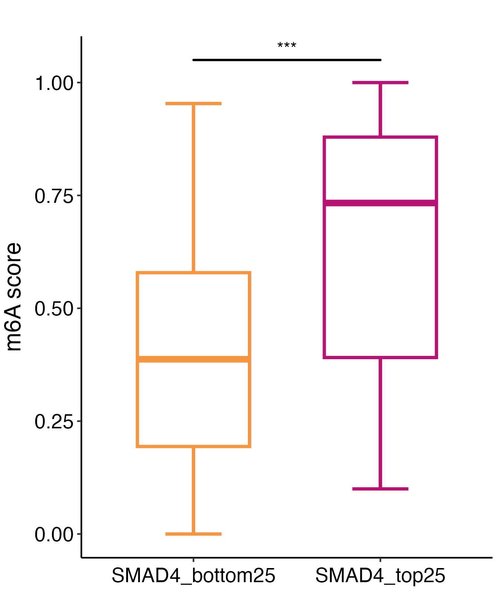

```

#### TCGA_SMAD4_mutation_exp_m6a_gene_boxplot_2

```{r,echo=FALSE,eval=FALSE,cache=TRUE}
library(ggplot2)
library(ggsignif)
library(ggpubr)


dat_exp <- dat[,-c(31,33)] %>% reshape2::melt(id.vars = c('exp_group'))
m6a_gene <- read.table('./Data/30_m6a_regulators.txt')
m6a_gene <- c(m6a_gene$V1)
dat_exp$variable <- factor(dat_exp$variable,levels = m6a_gene)

p <- ggboxplot(dat_exp, x = "variable", y = "value",
          fill = "exp_group", 
          palette = c("#B71375","#F79540"),
          outlier.shape=NA,
          size=0.3)+
  theme_bw()+
  stat_compare_means(aes(group = exp_group),
                     method = "wilcox.test",
                     label = "p.signif",
                     symnum.args=list(cutpoints = c(0, 0.001, 0.01, 0.05, 1),
                                      symbols = c("***", "**", "*", "ns")))+
  theme(panel.grid.major=element_line(colour=NA),
        panel.background = element_rect(fill = "transparent",colour = NA),
        plot.background = element_rect(fill = "transparent",colour = NA),
        panel.grid.minor = element_blank(),
        text = element_text(size=13),
        axis.text.x = element_text(angle=45, hjust=1),
        legend.position="top")+
  labs(x="", y="Expression of m6A regualtors",title = "")


ggsave('./Result/02-data_processing/TCGA_SMAD4_mutation_exp_m6a_gene_boxplot_2.png',p,width=15,height=5*1)

```

```{r,  echo=FALSE,out.width='100%',out.height='100%',fig.align='center',cache=TRUE}
library(knitr)
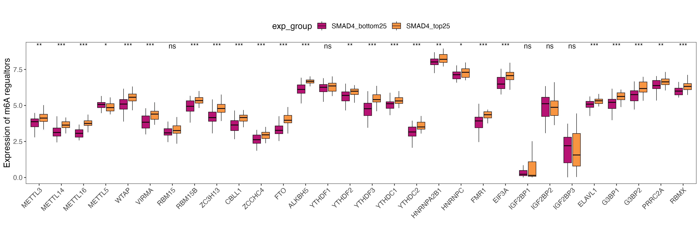

```


## TCGA-PAAD dataset option 3

* 仅包含11个writers
* SMAD4表达cutoff 50% 


```{r,echo=FALSE,eval=FALSE,cache=TRUE}  
# dir.create('./Result/02-data_processing')
rm(list = ls())
library(tidyverse)
library(magrittr)
library(GSVA)

load('../A01_Data_Processing/PAAD/TCGA/tcga_tmb_snp_cnv.rds')
load('/Users/djchen/Desktop/R data/A01_Data_Processing/PAAD/all_15_set.rds')
m6a_gene <- readxl::read_xlsx('./Data/m6a_list.xlsx',1)
m6a_gene <- m6a_gene %>% filter(Function == 'Writer') %>% select(Gene)
m6a_gene <- c(m6a_gene$Gene,'SMAD4')
tcga_exp <- all_15_set$TCGA %>% column_to_rownames('ID')
exp <- tcga_exp[,colnames(tcga_exp) %in% m6a_gene]
exp <- exp[rownames(exp) %in% colnames(TCGA_SNP),]
exp <- exp[colnames(TCGA_CNV),]
TCGA_SNP <- as.data.frame(t(TCGA_SNP))
identical(rownames(TCGA_SNP),rownames(exp))

dat <- exp
dat$mut_group <- ifelse(TCGA_SNP$SMAD4 == '','SMAD4_Wildtype','SMAD4_Mutated')
dat$exp_group <- ifelse(dat$SMAD4 > median(dat$SMAD4,na.rm = T),'SMAD4_High','SMAD4_Low')


# calculte the m6A score use GSVA
gmt_m6a <- list(m6a=m6a_gene)
exp_2 <- tcga_exp[,-c(1,2)] %>% t() %>% as.data.frame()
exp_2 <- exp_2[,rownames(dat)]
m6a_score <- gsva(as.matrix(exp_2), gmt_m6a,method='gsva',parallel.sz=5)
identical(colnames(m6a_score),rownames(dat))
dat$m6a_score <- as.numeric(m6a_score)
nr <-  function(x){(x - min(x))/diff(range(x))}
dat$m6a_score <- nr(dat$m6a_score)
dat <- dat[,-grep('SMAD4',colnames(dat))]

```

#### TCGA_SMAD4_mutation_exp_m6a_boxplot_3

```{r,echo=FALSE,eval=FALSE,cache=TRUE}
library(ggplot2)
library(ggsignif)

col <- c("#B71375","#F79540","#FC4F00")


p <- ggplot(data=dat)+
  stat_boxplot(aes(x=exp_group,y=m6a_score,colour = exp_group),geom="errorbar",width=0.3,size=1)+
  geom_boxplot(mapping=aes(x=exp_group,y=m6a_score,colour = exp_group),
               size=1,
               width = 0.6,
               outlier.color = NA)+
  scale_color_manual(limits=c('SMAD4_High','SMAD4_Low'),
                     values=c("#B71375","#F79540"))+
  geom_signif(mapping=aes(x=exp_group,y=m6a_score),
              comparisons = list(c("SMAD4_High","SMAD4_Low")),
              map_signif_level=T,
              tip_length=0,
              y_position = max(dat$m6a_score),
              size=0.7,
              textsize = 4,
              test = "wilcox.test")+
  theme_classic()+
  labs(title='',x="",y='m6A writers score')+
  theme(
    legend.position = 'none',
    axis.text.x = element_text(size = 13,
                               color = "black",
                               vjust = 0.5,
                               hjust = 0.5,
                               angle = 0),
    axis.text.y = element_text(size = 13,
                               color = "black",
                               vjust = 0.5,
                               hjust = 0.5,
                               angle = 0) ,
    axis.title.y = element_text(size = 15,
                                color = "black",
                                vjust = 1.9,
                                hjust = 0.5,
                                angle = 90)
  )


ggsave('./Result/02-data_processing/TCGA_SMAD4_mutation_exp_m6a_boxplot_3.png',p,width=4.5*1,height=5.5,)

```

```{r,  echo=FALSE,out.width='40%',out.height='40%',fig.align='center',cache=TRUE}
library(knitr)
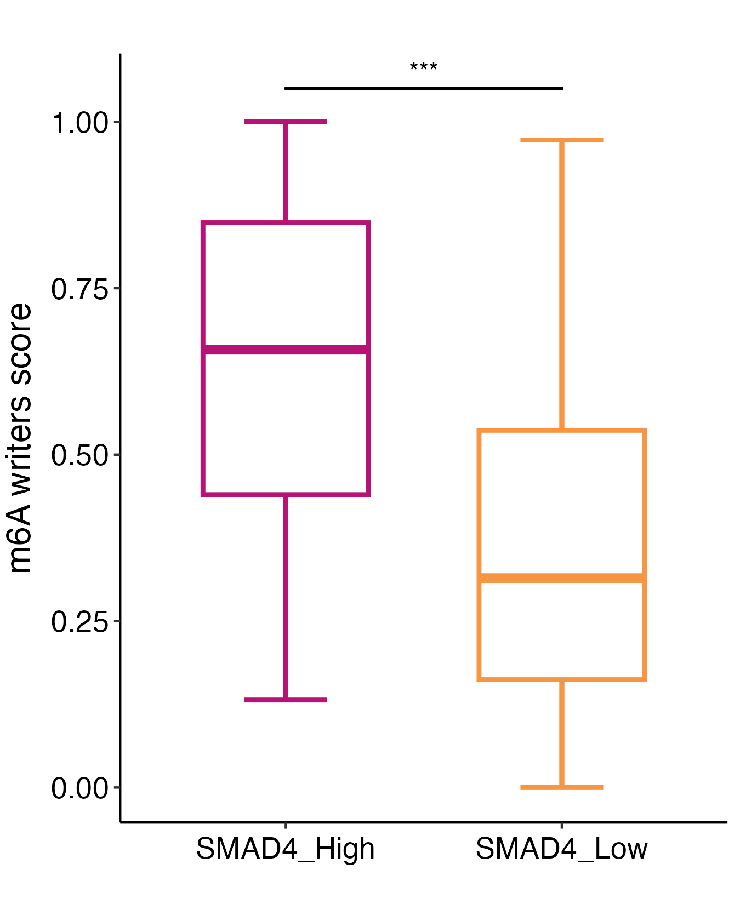

```

#### TCGA_SMAD4_mutation_exp_m6a_gene_boxplot_3

```{r,echo=FALSE,eval=FALSE,cache=TRUE}
library(ggplot2)
library(ggsignif)
library(ggpubr)


dat_exp <- dat[,-c(12,14)] %>% reshape2::melt(id.vars = c('exp_group'))
m6a_gene <- readxl::read_xlsx('./Data/m6a_list.xlsx',1)
m6a_gene <- m6a_gene %>% filter(Function == 'Writer') %>% select(Gene)
m6a_gene <- c(m6a_gene$Gene)
dat_exp$variable <- factor(dat_exp$variable,levels = m6a_gene)

p <- ggboxplot(dat_exp, x = "variable", y = "value",
          fill = "exp_group", 
          palette = c("#B71375","#F79540"),
          outlier.shape=NA,
          size=0.3)+
  theme_bw()+
  stat_compare_means(aes(group = exp_group),
                     method = "wilcox.test",
                     label = "p.signif",
                     symnum.args=list(cutpoints = c(0, 0.001, 0.01, 0.05, 1),
                                      symbols = c("***", "**", "*", "ns")))+
  theme(panel.grid.major=element_line(colour=NA),
        panel.background = element_rect(fill = "transparent",colour = NA),
        plot.background = element_rect(fill = "transparent",colour = NA),
        panel.grid.minor = element_blank(),
        text = element_text(size=13),
        axis.text.x = element_text(angle=45, hjust=1),
        legend.position="top")+
  labs(x="", y="Expression of m6A regualtors",title = "")


ggsave('./Result/02-data_processing/TCGA_SMAD4_mutation_exp_m6a_gene_boxplot_3.png',p,width=15,height=5*1)

```

```{r,  echo=FALSE,out.width='100%',out.height='100%',fig.align='center',cache=TRUE}
library(knitr)
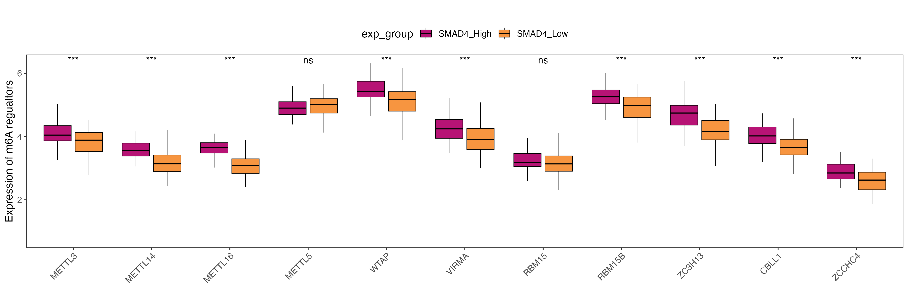

```


## CPTAC-PDAC dataset 

* 所有regulators
* SMAD4表达cutoff 50%

```{r,echo=FALSE,eval=FALSE,cache=TRUE}  
# dir.create('./Result/02-data_processing')
rm(list = ls())
library(tidyverse)
library(magrittr)
library(GSVA)

TCGA_SNP <- readRDS('../A01_Data_Processing/PAAD/CPTAC-PDAC/CDJ_PDAC_Cell_SNP_T_data.rds')
load('/Users/djchen/Desktop/R data/A01_Data_Processing/PAAD/all_15_set.rds')
m6a_gene <- read.table('./Data/30_m6a_regulators.txt')
m6a_gene <- c(m6a_gene$V1,'SMAD4')
tcga_exp <- all_15_set$CELL %>% column_to_rownames('ID')
exp <- tcga_exp[,colnames(tcga_exp) %in% m6a_gene]
inter_id <- intersect(rownames(exp),colnames(TCGA_SNP))
exp <- exp[inter_id,] #135
# exp <- exp[colnames(TCGA_SNP),]
TCGA_SNP <- as.data.frame(t(TCGA_SNP[,inter_id]))
identical(rownames(TCGA_SNP),rownames(exp))

dat <- exp
dat$mut_group <- ifelse(TCGA_SNP$SMAD4 == 'WT','SMAD4_Wildtype','SMAD4_Mutated')
dat$exp_group <- ifelse(dat$SMAD4 > median(dat$SMAD4,na.rm = T),'SMAD4_High','SMAD4_Low')

# calculte the m6A score use GSVA
gmt_m6a <- list(m6a=m6a_gene)
exp_2 <- tcga_exp[,-c(1,2)] %>% t() %>% as.data.frame()
exp_2 <- exp_2[,rownames(dat)]
m6a_score <- gsva(as.matrix(exp_2), gmt_m6a,method='gsva',parallel.sz=5)
identical(colnames(m6a_score),rownames(dat))
dat$m6a_score <- as.numeric(m6a_score)
nr <-  function(x){(x - min(x))/diff(range(x))}
dat$m6a_score <- nr(dat$m6a_score)
dat <- dat[,-grep('SMAD4',colnames(dat))]

```

#### CPTAC_SMAD4_mutation_exp_m6a_boxplot

```{r,echo=FALSE,eval=FALSE,cache=TRUE}
library(ggplot2)
library(ggsignif)

col <- c("#B71375","#F79540","#FC4F00")

p1 <- ggplot(data=dat)+
  stat_boxplot(aes(x=mut_group,y=m6a_score,colour = mut_group),geom="errorbar",width=0.3,size=1)+
  geom_boxplot(mapping=aes(x=mut_group,y=m6a_score,colour = mut_group),
               size=1,
               width = 0.6,
               outlier.color = NA)+
  scale_color_manual(limits=c('SMAD4_Mutated','SMAD4_Wildtype'),
                     values=c("#B71375","#F79540"))+
  geom_signif(mapping=aes(x=mut_group,y=m6a_score),
              comparisons = list(c("SMAD4_Mutated","SMAD4_Wildtype")),
              map_signif_level=T,
              tip_length=0,
              y_position = max(dat$m6a_score),
              size=0.7,
              textsize = 4,
              test = "wilcox.test")+
  theme_classic()+
  labs(title='',x="",y='m6A score')+
  theme(
    legend.position = 'none',
    axis.text.x = element_text(size = 13,
                               color = "black",
                               vjust = 0.5,
                               hjust = 0.5,
                               angle = 0),
    axis.text.y = element_text(size = 13,
                               color = "black",
                               vjust = 0.5,
                               hjust = 0.5,
                               angle = 0) ,
    axis.title.y = element_text(size = 15,
                                color = "black",
                                vjust = 1.9,
                                hjust = 0.5,
                                angle = 90)
  )


p2 <- ggplot(data=dat)+
  stat_boxplot(aes(x=exp_group,y=m6a_score,colour = exp_group),geom="errorbar",width=0.3,size=1)+
  geom_boxplot(mapping=aes(x=exp_group,y=m6a_score,colour = exp_group),
               size=1,
               width = 0.6,
               outlier.color = NA)+
  scale_color_manual(limits=c('SMAD4_High','SMAD4_Low'),
                     values=c("#B71375","#F79540"))+
  geom_signif(mapping=aes(x=exp_group,y=m6a_score),
              comparisons = list(c("SMAD4_High","SMAD4_Low")),
              map_signif_level=T,
              tip_length=0,
              y_position = max(dat$m6a_score),
              size=0.7,
              textsize = 4,
              test = "wilcox.test")+
  theme_classic()+
  labs(title='',x="",y='m6A score')+
  theme(
    legend.position = 'none',
    axis.text.x = element_text(size = 13,
                               color = "black",
                               vjust = 0.5,
                               hjust = 0.5,
                               angle = 0),
    axis.text.y = element_text(size = 13,
                               color = "black",
                               vjust = 0.5,
                               hjust = 0.5,
                               angle = 0) ,
    axis.title.y = element_text(size = 15,
                                color = "black",
                                vjust = 1.9,
                                hjust = 0.5,
                                angle = 90)
  )

library(gridExtra)
p3 <- grid.arrange(p1,p2,ncol=2)
ggsave('./Result/02-data_processing/CPTAC_SMAD4_mutation_exp_m6a_boxplot.png',p3,width=4.5*2,height=5.5,)

```

```{r,  echo=FALSE,out.width='80%',out.height='80%',fig.align='center',cache=TRUE}
library(knitr)
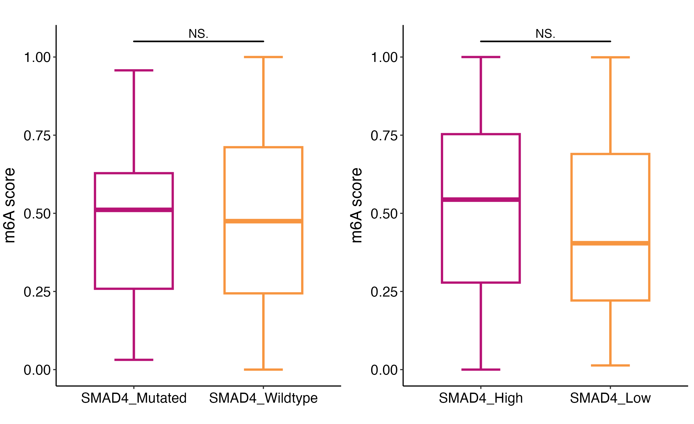

```

#### CPTAC_SMAD4_mutation_exp_m6a_gene_boxplot

```{r,echo=FALSE,eval=FALSE,cache=TRUE}
library(ggplot2)
library(ggsignif)
library(ggpubr)

dat_mut <- dat[,-(32:33)] %>% reshape2::melt(id.vars = c('mut_group'))
m6a_gene <- read.table('./Data/30_m6a_regulators.txt')
m6a_gene <- c(m6a_gene$V1)
dat_mut$variable <- factor(dat_mut$variable,levels = m6a_gene)

p1 <- ggboxplot(dat_mut, x = "variable", y = "value",
          fill = "mut_group", 
          palette = c("#B71375","#F79540"),
          outlier.shape=NA,
          size=0.3)+
  theme_bw()+
  stat_compare_means(aes(group = mut_group),
                     method = "wilcox.test",
                     label = "p.signif",
                     symnum.args=list(cutpoints = c(0, 0.001, 0.01, 0.05, 1),
                                      symbols = c("***", "**", "*", "ns")))+
  theme(panel.grid.major=element_line(colour=NA),
        panel.background = element_rect(fill = "transparent",colour = NA),
        plot.background = element_rect(fill = "transparent",colour = NA),
        panel.grid.minor = element_blank(),
        text = element_text(size=13),
        axis.text.x = element_text(angle=45, hjust=1),
        legend.position="top")+
  labs(x="", y="Expression of m6A regualtors",title = "")

dat_exp <- dat[,-c(31,33)] %>% reshape2::melt(id.vars = c('exp_group'))
m6a_gene <- read.table('./Data/30_m6a_regulators.txt')
m6a_gene <- c(m6a_gene$V1)
dat_exp$variable <- factor(dat_exp$variable,levels = m6a_gene)

p2 <- ggboxplot(dat_exp, x = "variable", y = "value",
          fill = "exp_group", 
          palette = c("#B71375","#F79540"),
          outlier.shape=NA,
          size=0.3)+
  theme_bw()+
  stat_compare_means(aes(group = exp_group),
                     method = "wilcox.test",
                     label = "p.signif",
                     symnum.args=list(cutpoints = c(0, 0.001, 0.01, 0.05, 1),
                                      symbols = c("***", "**", "*", "ns")))+
  theme(panel.grid.major=element_line(colour=NA),
        panel.background = element_rect(fill = "transparent",colour = NA),
        plot.background = element_rect(fill = "transparent",colour = NA),
        panel.grid.minor = element_blank(),
        text = element_text(size=13),
        axis.text.x = element_text(angle=45, hjust=1),
        legend.position="top")+
  labs(x="", y="Expression of m6A regualtors",title = "")

library(gridExtra)
p3 <- grid.arrange(p1,p2,ncol=1,nrow=2)
ggsave('./Result/02-data_processing/CPTAC_SMAD4_mutation_exp_m6a_gene_boxplot.png',p3,width=15,height=5*2)

```

```{r,  echo=FALSE,out.width='100%',out.height='100%',fig.align='center',cache=TRUE}
library(knitr)
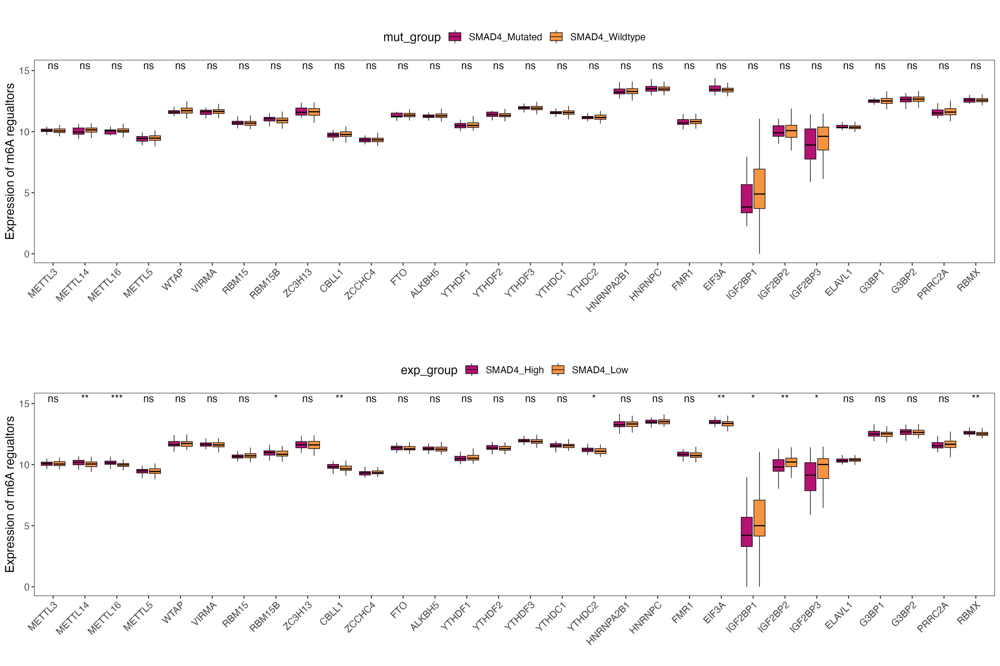

```


## RJ dataset 

* 【RJ DATA SNP数据存疑】
* 所有regulators
* SMAD4表达cutoff 50%

```{r,echo=FALSE,eval=FALSE,cache=TRUE}  
# dir.create('./Result/02-data_processing')
rm(list = ls())

library(tidyverse)
library(magrittr)
library(GSVA)


load('../Case18 pro_NAT/A02_Result_v2/8-Sub_clinical/Trans_info_new.Rdata')
identical(colnames(trans_exp),trans_pd$Trans_ID)

trans_pd <- trans_pd[trans_pd$SampleType=='PDAC',] #117
TCGA_SNP <- readRDS('../Case18 pro_NAT/Data/00_Raw_data/多组学s191用到的转录组+蛋白组/mut/pc.wes.panel.128s.onco.mat.fv.rds')
inter_id <- intersect(trans_pd$AD,colnames(TCGA_SNP)) # 72
trans_pd <- trans_pd[trans_pd$AD %in% inter_id,]
trans_exp <- trans_exp[,trans_pd$Trans_ID]
colnames(trans_exp) <- trans_pd$AD


m6a_gene <- read.table('./Data/30_m6a_regulators.txt')
m6a_gene <- c(m6a_gene$V1,'SMAD4')
tcga_exp <- trans_exp %>% t() %>% as.data.frame()
exp <- tcga_exp[,colnames(tcga_exp) %in% m6a_gene]
inter_id <- intersect(rownames(exp),colnames(TCGA_SNP))
exp <- exp[inter_id,] #135
# exp <- exp[colnames(TCGA_SNP),]
TCGA_SNP <- as.data.frame(t(TCGA_SNP[,inter_id]))
identical(rownames(TCGA_SNP),rownames(exp))

dat <- exp
dat$mut_group <- ifelse(TCGA_SNP$SMAD4 == '','SMAD4_Wildtype','SMAD4_Mutated')
dat$exp_group <- ifelse(dat$SMAD4 > median(dat$SMAD4,na.rm = T),'SMAD4_High','SMAD4_Low')

# calculte the m6A score use GSVA
gmt_m6a <- list(m6a=m6a_gene)
exp_2 <- tcga_exp %>% t() %>% as.data.frame()
exp_2 <- exp_2[,rownames(dat)]
m6a_score <- gsva(as.matrix(exp_2), gmt_m6a,method='gsva',parallel.sz=5)
identical(colnames(m6a_score),rownames(dat))
dat$m6a_score <- as.numeric(m6a_score)
nr <-  function(x){(x - min(x))/diff(range(x))}
dat$m6a_score <- nr(dat$m6a_score)
dat <- dat[,-grep('SMAD4',colnames(dat))]

```

#### RJ_SMAD4_mutation_exp_m6a_boxplot

```{r,echo=FALSE,eval=FALSE,cache=TRUE}
library(ggplot2)
library(ggsignif)

col <- c("#B71375","#F79540","#FC4F00")

p1 <- ggplot(data=dat)+
  stat_boxplot(aes(x=mut_group,y=m6a_score,colour = mut_group),geom="errorbar",width=0.3,size=1)+
  geom_boxplot(mapping=aes(x=mut_group,y=m6a_score,colour = mut_group),
               size=1,
               width = 0.6,
               outlier.color = NA)+
  scale_color_manual(limits=c('SMAD4_Mutated','SMAD4_Wildtype'),
                     values=c("#B71375","#F79540"))+
  geom_signif(mapping=aes(x=mut_group,y=m6a_score),
              comparisons = list(c("SMAD4_Mutated","SMAD4_Wildtype")),
              map_signif_level=T,
              tip_length=0,
              y_position = max(dat$m6a_score),
              size=0.7,
              textsize = 4,
              test = "wilcox.test")+
  theme_classic()+
  labs(title='',x="",y='m6A score')+
  theme(
    legend.position = 'none',
    axis.text.x = element_text(size = 13,
                               color = "black",
                               vjust = 0.5,
                               hjust = 0.5,
                               angle = 0),
    axis.text.y = element_text(size = 13,
                               color = "black",
                               vjust = 0.5,
                               hjust = 0.5,
                               angle = 0) ,
    axis.title.y = element_text(size = 15,
                                color = "black",
                                vjust = 1.9,
                                hjust = 0.5,
                                angle = 90)
  )


p2 <- ggplot(data=dat)+
  stat_boxplot(aes(x=exp_group,y=m6a_score,colour = exp_group),geom="errorbar",width=0.3,size=1)+
  geom_boxplot(mapping=aes(x=exp_group,y=m6a_score,colour = exp_group),
               size=1,
               width = 0.6,
               outlier.color = NA)+
  scale_color_manual(limits=c('SMAD4_High','SMAD4_Low'),
                     values=c("#B71375","#F79540"))+
  geom_signif(mapping=aes(x=exp_group,y=m6a_score),
              comparisons = list(c("SMAD4_High","SMAD4_Low")),
              map_signif_level=T,
              tip_length=0,
              y_position = max(dat$m6a_score),
              size=0.7,
              textsize = 4,
              test = "wilcox.test")+
  theme_classic()+
  labs(title='',x="",y='m6A score')+
  theme(
    legend.position = 'none',
    axis.text.x = element_text(size = 13,
                               color = "black",
                               vjust = 0.5,
                               hjust = 0.5,
                               angle = 0),
    axis.text.y = element_text(size = 13,
                               color = "black",
                               vjust = 0.5,
                               hjust = 0.5,
                               angle = 0) ,
    axis.title.y = element_text(size = 15,
                                color = "black",
                                vjust = 1.9,
                                hjust = 0.5,
                                angle = 90)
  )

library(gridExtra)
p3 <- grid.arrange(p1,p2,ncol=2)
ggsave('./Result/02-data_processing/RJ_SMAD4_mutation_exp_m6a_boxplot.png',p3,width=4.5*2,height=5.5,)

```

```{r,  echo=FALSE,out.width='80%',out.height='80%',fig.align='center',cache=TRUE}
library(knitr)
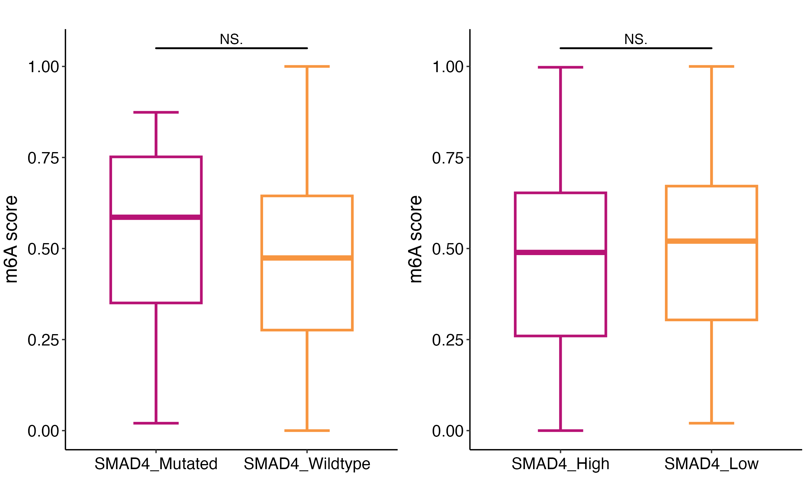

```

#### RJ_SMAD4_mutation_exp_m6a_gene_boxplot

```{r,echo=FALSE,eval=FALSE,cache=TRUE}
library(ggplot2)
library(ggsignif)
library(ggpubr)

dat_mut <- dat[,-(32:33)] %>% reshape2::melt(id.vars = c('mut_group'))
m6a_gene <- read.table('./Data/30_m6a_regulators.txt')
m6a_gene <- c(m6a_gene$V1)
dat_mut$variable <- factor(dat_mut$variable,levels = m6a_gene)

p1 <- ggboxplot(dat_mut, x = "variable", y = "value",
          fill = "mut_group", 
          palette = c("#B71375","#F79540"),
          outlier.shape=NA,
          size=0.3)+
  theme_bw()+
  stat_compare_means(aes(group = mut_group),
                     method = "wilcox.test",
                     label = "p.signif",
                     symnum.args=list(cutpoints = c(0, 0.001, 0.01, 0.05, 1),
                                      symbols = c("***", "**", "*", "ns")))+
  theme(panel.grid.major=element_line(colour=NA),
        panel.background = element_rect(fill = "transparent",colour = NA),
        plot.background = element_rect(fill = "transparent",colour = NA),
        panel.grid.minor = element_blank(),
        text = element_text(size=13),
        axis.text.x = element_text(angle=45, hjust=1),
        legend.position="top")+
  labs(x="", y="Expression of m6A regualtors",title = "")

dat_exp <- dat[,-c(31,33)] %>% reshape2::melt(id.vars = c('exp_group'))
m6a_gene <- read.table('./Data/30_m6a_regulators.txt')
m6a_gene <- c(m6a_gene$V1)
dat_exp$variable <- factor(dat_exp$variable,levels = m6a_gene)

p2 <- ggboxplot(dat_exp, x = "variable", y = "value",
          fill = "exp_group", 
          palette = c("#B71375","#F79540"),
          outlier.shape=NA,
          size=0.3)+
  theme_bw()+
  stat_compare_means(aes(group = exp_group),
                     method = "wilcox.test",
                     label = "p.signif",
                     symnum.args=list(cutpoints = c(0, 0.001, 0.01, 0.05, 1),
                                      symbols = c("***", "**", "*", "ns")))+
  theme(panel.grid.major=element_line(colour=NA),
        panel.background = element_rect(fill = "transparent",colour = NA),
        plot.background = element_rect(fill = "transparent",colour = NA),
        panel.grid.minor = element_blank(),
        text = element_text(size=13),
        axis.text.x = element_text(angle=45, hjust=1),
        legend.position="top")+
  labs(x="", y="Expression of m6A regualtors",title = "")

library(gridExtra)
p3 <- grid.arrange(p1,p2,ncol=1,nrow=2)
ggsave('./Result/02-data_processing/RJ_SMAD4_mutation_exp_m6a_gene_boxplot.png',p3,width=15,height=5*2)

```

```{r,  echo=FALSE,out.width='100%',out.height='100%',fig.align='center',cache=TRUE}
library(knitr)
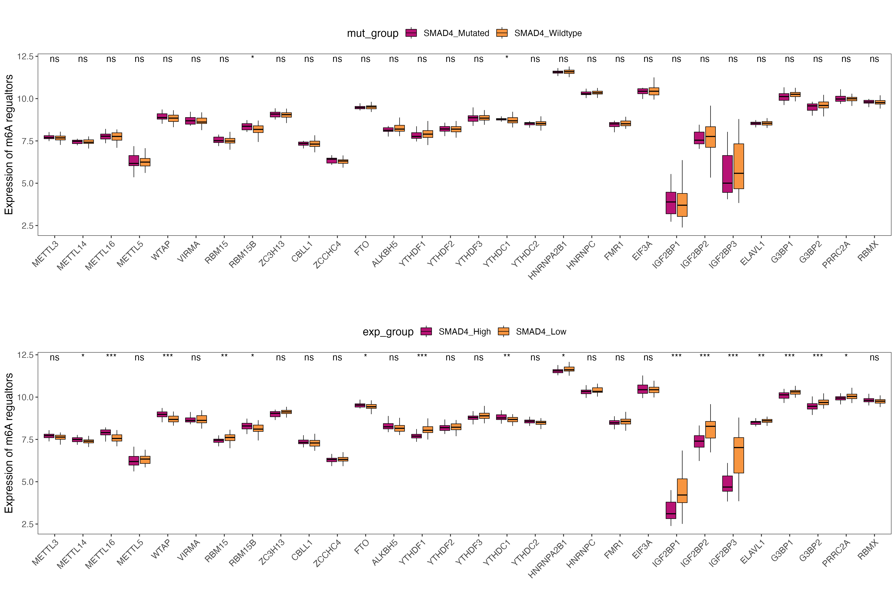

```


## RNA modifications

* doi: 10.1155/2022/8976179
* 100 RNA modification regulators
* SMAD4 cutoff 50% 


### TCGA-PAAD

```{r,echo=FALSE,eval=FALSE,cache=TRUE}  
# dir.create('./Result/02-data_processing')
rm(list = ls())
library(tidyverse)
library(magrittr)
library(GSVA)

load('../A01_Data_Processing/PAAD/TCGA/tcga_tmb_snp_cnv.rds')
load('/Users/djchen/Desktop/R data/A01_Data_Processing/PAAD/all_15_set.rds')
m6a_gene <- readxl::read_xlsx('./Data/Table1_Analysis of eight types of RNA modification regulators and their correlation with the prognosis in hepatocellular carcinoma.XLSX',1)
m6a_gene <- m6a_gene$Gene.Name
m6a_gene <- c(m6a_gene,'SMAD4')
tcga_exp <- all_15_set$TCGA %>% column_to_rownames('ID')
exp <- tcga_exp[,colnames(tcga_exp) %in% m6a_gene]
exp <- exp[rownames(exp) %in% colnames(TCGA_SNP),]
exp <- exp[colnames(TCGA_CNV),]
TCGA_SNP <- as.data.frame(t(TCGA_SNP))
identical(rownames(TCGA_SNP),rownames(exp))

dat <- exp
dat$mut_group <- ifelse(TCGA_SNP$SMAD4 == '','SMAD4_Wildtype','SMAD4_Mutated')
dat$exp_group <- ifelse(dat$SMAD4 > median(dat$SMAD4,na.rm = T),'SMAD4_High','SMAD4_Low')


# calculte the m6A score use GSVA
gmt_m6a <- list(m6a=m6a_gene)
exp_2 <- tcga_exp[,-c(1,2)] %>% t() %>% as.data.frame()
exp_2 <- exp_2[,rownames(dat)]
m6a_score <- gsva(as.matrix(exp_2), gmt_m6a,method='gsva',parallel.sz=5)
identical(colnames(m6a_score),rownames(dat))
dat$m6a_score <- as.numeric(m6a_score)
nr <-  function(x){(x - min(x))/diff(range(x))}
dat$m6a_score <- nr(dat$m6a_score)
dat <- dat[,-grep('SMAD4',colnames(dat))]

library(ggplot2)
library(ggsignif)

col <- c("#B71375","#F79540","#FC4F00")


p1 <- ggplot(data=dat)+
  stat_boxplot(aes(x=mut_group,y=m6a_score,colour = mut_group),geom="errorbar",width=0.3,size=1)+
  geom_boxplot(mapping=aes(x=mut_group,y=m6a_score,colour = mut_group),
               size=1,
               width = 0.6,
               outlier.color = NA)+
  scale_color_manual(limits=c('SMAD4_Mutated','SMAD4_Wildtype'),
                     values=c("#B71375","#F79540"))+
  geom_signif(mapping=aes(x=mut_group,y=m6a_score),
              comparisons = list(c("SMAD4_Mutated","SMAD4_Wildtype")),
              map_signif_level=T,
              tip_length=0,
              y_position = max(dat$m6a_score),
              size=0.7,
              textsize = 4,
              test = "wilcox.test")+
  theme_classic()+
  labs(title='',x="",y='RNA modification score')+
  theme(
    legend.position = 'none',
    axis.text.x = element_text(size = 13,
                               color = "black",
                               vjust = 0.5,
                               hjust = 0.5,
                               angle = 0),
    axis.text.y = element_text(size = 13,
                               color = "black",
                               vjust = 0.5,
                               hjust = 0.5,
                               angle = 0) ,
    axis.title.y = element_text(size = 15,
                                color = "black",
                                vjust = 1.9,
                                hjust = 0.5,
                                angle = 90)
  )


p2 <- ggplot(data=dat)+
  stat_boxplot(aes(x=exp_group,y=m6a_score,colour = exp_group),geom="errorbar",width=0.3,size=1)+
  geom_boxplot(mapping=aes(x=exp_group,y=m6a_score,colour = exp_group),
               size=1,
               width = 0.6,
               outlier.color = NA)+
  scale_color_manual(limits=c('SMAD4_High','SMAD4_Low'),
                     values=c("#B71375","#F79540"))+
  geom_signif(mapping=aes(x=exp_group,y=m6a_score),
              comparisons = list(c("SMAD4_High","SMAD4_Low")),
              map_signif_level=T,
              tip_length=0,
              y_position = max(dat$m6a_score),
              size=0.7,
              textsize = 4,
              test = "wilcox.test")+
  theme_classic()+
  labs(title='',x="",y='RNA modification score')+
  theme(
    legend.position = 'none',
    axis.text.x = element_text(size = 13,
                               color = "black",
                               vjust = 0.5,
                               hjust = 0.5,
                               angle = 0),
    axis.text.y = element_text(size = 13,
                               color = "black",
                               vjust = 0.5,
                               hjust = 0.5,
                               angle = 0) ,
    axis.title.y = element_text(size = 15,
                                color = "black",
                                vjust = 1.9,
                                hjust = 0.5,
                                angle = 90)
  )

library(gridExtra)
p3 <- grid.arrange(p1,p2,ncol=2)
ggsave('./Result/02-data_processing/RNA_mod_TCGA.png',p3,width=4.5*2,height=5.5)


```

```{r,  echo=FALSE,out.width='100%',out.height='100%',fig.align='center',cache=TRUE}
library(knitr)
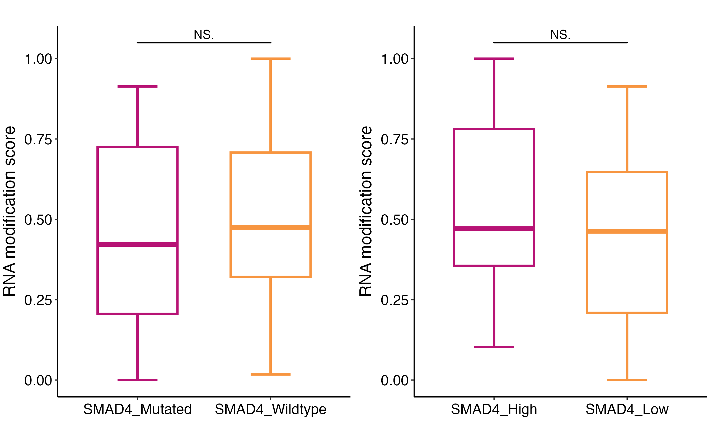

```


### CPTAC-PDAC

```{r,echo=FALSE,eval=FALSE,cache=TRUE}  
# dir.create('./Result/02-data_processing')
rm(list = ls())
library(tidyverse)
library(magrittr)
library(GSVA)

TCGA_SNP <- readRDS('../A01_Data_Processing/PAAD/CPTAC-PDAC/CDJ_PDAC_Cell_SNP_T_data.rds')
load('/Users/djchen/Desktop/R data/A01_Data_Processing/PAAD/all_15_set.rds')
m6a_gene <- readxl::read_xlsx('./Data/Table1_Analysis of eight types of RNA modification regulators and their correlation with the prognosis in hepatocellular carcinoma.XLSX',1)
m6a_gene <- c(m6a_gene$Gene.Name,'SMAD4')
tcga_exp <- all_15_set$CELL %>% column_to_rownames('ID')
exp <- tcga_exp[,colnames(tcga_exp) %in% m6a_gene]
inter_id <- intersect(rownames(exp),colnames(TCGA_SNP))
exp <- exp[inter_id,] #135
# exp <- exp[colnames(TCGA_SNP),]
TCGA_SNP <- as.data.frame(t(TCGA_SNP[,inter_id]))
identical(rownames(TCGA_SNP),rownames(exp))

dat <- exp
dat$mut_group <- ifelse(TCGA_SNP$SMAD4 == 'WT','SMAD4_Wildtype','SMAD4_Mutated')
dat$exp_group <- ifelse(dat$SMAD4 > median(dat$SMAD4,na.rm = T),'SMAD4_High','SMAD4_Low')

# calculte the m6A score use GSVA
gmt_m6a <- list(m6a=m6a_gene)
exp_2 <- tcga_exp[,-c(1,2)] %>% t() %>% as.data.frame()
exp_2 <- exp_2[,rownames(dat)]
m6a_score <- gsva(as.matrix(exp_2), gmt_m6a,method='gsva',parallel.sz=5)
identical(colnames(m6a_score),rownames(dat))
dat$m6a_score <- as.numeric(m6a_score)
nr <-  function(x){(x - min(x))/diff(range(x))}
dat$m6a_score <- nr(dat$m6a_score)
dat <- dat[,-grep('SMAD4',colnames(dat))]

library(ggplot2)
library(ggsignif)

col <- c("#B71375","#F79540","#FC4F00")

p1 <- ggplot(data=dat)+
  stat_boxplot(aes(x=mut_group,y=m6a_score,colour = mut_group),geom="errorbar",width=0.3,size=1)+
  geom_boxplot(mapping=aes(x=mut_group,y=m6a_score,colour = mut_group),
               size=1,
               width = 0.6,
               outlier.color = NA)+
  scale_color_manual(limits=c('SMAD4_Mutated','SMAD4_Wildtype'),
                     values=c("#B71375","#F79540"))+
  geom_signif(mapping=aes(x=mut_group,y=m6a_score),
              comparisons = list(c("SMAD4_Mutated","SMAD4_Wildtype")),
              map_signif_level=T,
              tip_length=0,
              y_position = max(dat$m6a_score),
              size=0.7,
              textsize = 4,
              test = "wilcox.test")+
  theme_classic()+
  labs(title='',x="",y='RNA modification score')+
  theme(
    legend.position = 'none',
    axis.text.x = element_text(size = 13,
                               color = "black",
                               vjust = 0.5,
                               hjust = 0.5,
                               angle = 0),
    axis.text.y = element_text(size = 13,
                               color = "black",
                               vjust = 0.5,
                               hjust = 0.5,
                               angle = 0) ,
    axis.title.y = element_text(size = 15,
                                color = "black",
                                vjust = 1.9,
                                hjust = 0.5,
                                angle = 90)
  )


p2 <- ggplot(data=dat)+
  stat_boxplot(aes(x=exp_group,y=m6a_score,colour = exp_group),geom="errorbar",width=0.3,size=1)+
  geom_boxplot(mapping=aes(x=exp_group,y=m6a_score,colour = exp_group),
               size=1,
               width = 0.6,
               outlier.color = NA)+
  scale_color_manual(limits=c('SMAD4_High','SMAD4_Low'),
                     values=c("#B71375","#F79540"))+
  geom_signif(mapping=aes(x=exp_group,y=m6a_score),
              comparisons = list(c("SMAD4_High","SMAD4_Low")),
              map_signif_level=T,
              tip_length=0,
              y_position = max(dat$m6a_score),
              size=0.7,
              textsize = 4,
              test = "wilcox.test")+
  theme_classic()+
  labs(title='',x="",y='RNA modification score')+
  theme(
    legend.position = 'none',
    axis.text.x = element_text(size = 13,
                               color = "black",
                               vjust = 0.5,
                               hjust = 0.5,
                               angle = 0),
    axis.text.y = element_text(size = 13,
                               color = "black",
                               vjust = 0.5,
                               hjust = 0.5,
                               angle = 0) ,
    axis.title.y = element_text(size = 15,
                                color = "black",
                                vjust = 1.9,
                                hjust = 0.5,
                                angle = 90)
  )

library(gridExtra)
p3 <- grid.arrange(p1,p2,ncol=2)
ggsave('./Result/02-data_processing/RNA_mod_CPTAC.png',p3,width=4.5*2,height=5.5)

```

```{r,  echo=FALSE,out.width='100%',out.height='100%',fig.align='center',cache=TRUE}
library(knitr)
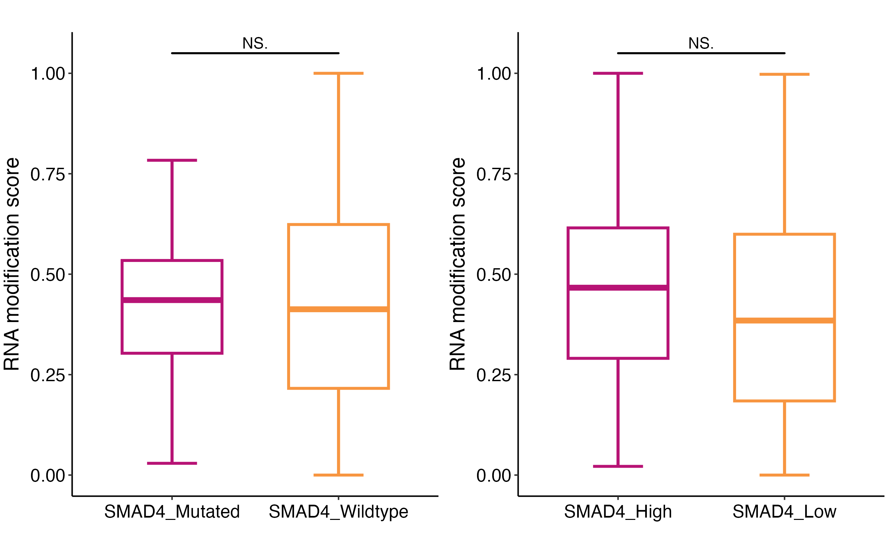

```


### RJ-cohort

```{r,echo=FALSE,eval=FALSE,cache=TRUE}  
# dir.create('./Result/02-data_processing')
rm(list = ls())

library(tidyverse)
library(magrittr)
library(GSVA)


load('../Case18 pro_NAT/A02_Result_v2/8-Sub_clinical/Trans_info_new.Rdata')
identical(colnames(trans_exp),trans_pd$Trans_ID)

trans_pd <- trans_pd[trans_pd$SampleType=='PDAC',] #117
TCGA_SNP <- readRDS('../Case18 pro_NAT/Data/00_Raw_data/多组学s191用到的转录组+蛋白组/mut/pc.wes.panel.128s.onco.mat.fv.rds')
inter_id <- intersect(trans_pd$AD,colnames(TCGA_SNP)) # 72
trans_pd <- trans_pd[trans_pd$AD %in% inter_id,]
trans_exp <- trans_exp[,trans_pd$Trans_ID]
colnames(trans_exp) <- trans_pd$AD


m6a_gene <- readxl::read_xlsx('./Data/Table1_Analysis of eight types of RNA modification regulators and their correlation with the prognosis in hepatocellular carcinoma.XLSX',1)
m6a_gene <- c(m6a_gene$Gene.Name,'SMAD4')
tcga_exp <- trans_exp %>% t() %>% as.data.frame()
exp <- tcga_exp[,colnames(tcga_exp) %in% m6a_gene]
inter_id <- intersect(rownames(exp),colnames(TCGA_SNP))
exp <- exp[inter_id,] #135
# exp <- exp[colnames(TCGA_SNP),]
TCGA_SNP <- as.data.frame(t(TCGA_SNP[,inter_id]))
identical(rownames(TCGA_SNP),rownames(exp))

dat <- exp
dat$mut_group <- ifelse(TCGA_SNP$SMAD4 == '','SMAD4_Wildtype','SMAD4_Mutated')
dat$exp_group <- ifelse(dat$SMAD4 > median(dat$SMAD4,na.rm = T),'SMAD4_High','SMAD4_Low')

# calculte the m6A score use GSVA
gmt_m6a <- list(m6a=m6a_gene)
exp_2 <- tcga_exp %>% t() %>% as.data.frame()
exp_2 <- exp_2[,rownames(dat)]
m6a_score <- gsva(as.matrix(exp_2), gmt_m6a,method='gsva',parallel.sz=5)
identical(colnames(m6a_score),rownames(dat))
dat$m6a_score <- as.numeric(m6a_score)
nr <-  function(x){(x - min(x))/diff(range(x))}
dat$m6a_score <- nr(dat$m6a_score)
dat <- dat[,-grep('SMAD4',colnames(dat))]

library(ggplot2)
library(ggsignif)

col <- c("#B71375","#F79540","#FC4F00")

p1 <- ggplot(data=dat)+
  stat_boxplot(aes(x=mut_group,y=m6a_score,colour = mut_group),geom="errorbar",width=0.3,size=1)+
  geom_boxplot(mapping=aes(x=mut_group,y=m6a_score,colour = mut_group),
               size=1,
               width = 0.6,
               outlier.color = NA)+
  scale_color_manual(limits=c('SMAD4_Mutated','SMAD4_Wildtype'),
                     values=c("#B71375","#F79540"))+
  geom_signif(mapping=aes(x=mut_group,y=m6a_score),
              comparisons = list(c("SMAD4_Mutated","SMAD4_Wildtype")),
              map_signif_level=T,
              tip_length=0,
              y_position = max(dat$m6a_score),
              size=0.7,
              textsize = 4,
              test = "wilcox.test")+
  theme_classic()+
  labs(title='',x="",y='RNA modification score')+
  theme(
    legend.position = 'none',
    axis.text.x = element_text(size = 13,
                               color = "black",
                               vjust = 0.5,
                               hjust = 0.5,
                               angle = 0),
    axis.text.y = element_text(size = 13,
                               color = "black",
                               vjust = 0.5,
                               hjust = 0.5,
                               angle = 0) ,
    axis.title.y = element_text(size = 15,
                                color = "black",
                                vjust = 1.9,
                                hjust = 0.5,
                                angle = 90)
  )


p2 <- ggplot(data=dat)+
  stat_boxplot(aes(x=exp_group,y=m6a_score,colour = exp_group),geom="errorbar",width=0.3,size=1)+
  geom_boxplot(mapping=aes(x=exp_group,y=m6a_score,colour = exp_group),
               size=1,
               width = 0.6,
               outlier.color = NA)+
  scale_color_manual(limits=c('SMAD4_High','SMAD4_Low'),
                     values=c("#B71375","#F79540"))+
  geom_signif(mapping=aes(x=exp_group,y=m6a_score),
              comparisons = list(c("SMAD4_High","SMAD4_Low")),
              map_signif_level=T,
              tip_length=0,
              y_position = max(dat$m6a_score),
              size=0.7,
              textsize = 4,
              test = "wilcox.test")+
  theme_classic()+
  labs(title='',x="",y='RNA modification score')+
  theme(
    legend.position = 'none',
    axis.text.x = element_text(size = 13,
                               color = "black",
                               vjust = 0.5,
                               hjust = 0.5,
                               angle = 0),
    axis.text.y = element_text(size = 13,
                               color = "black",
                               vjust = 0.5,
                               hjust = 0.5,
                               angle = 0) ,
    axis.title.y = element_text(size = 15,
                                color = "black",
                                vjust = 1.9,
                                hjust = 0.5,
                                angle = 90)
  )

library(gridExtra)
p3 <- grid.arrange(p1,p2,ncol=2)
ggsave('./Result/02-data_processing/RNA_mod_RJ.png',p3,width=4.5*2,height=5.5)
```

```{r,  echo=FALSE,out.width='100%',out.height='100%',fig.align='center',cache=TRUE}
library(knitr)
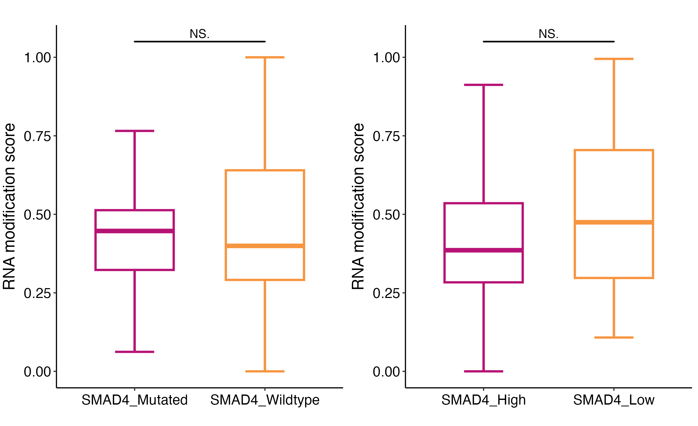

```


